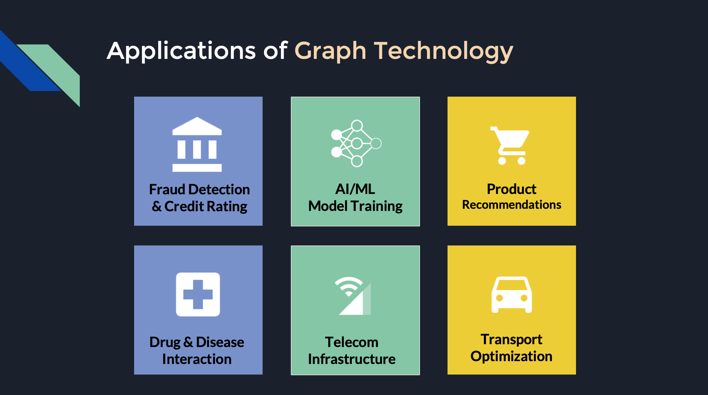

Watch this space for resources related to Zak Mandhro's talk on **Architecting the Future with Graph Technology**.

Motivation: Facebook, LinkedIn, Google and Twitter would not have been possible without Graph Technology.

- As our systems become more complex, intelligent, interconnected, our traditional tools just don't scale. Graph Technology replaces traditional database and APIs to unlock the business use cases of the future.
- This talk will provide a business-oriented overview of the limitations of current technology and the advantages Graph.
- I'll cover the powerful business use cases that Graph enables, including AI, fraud detection, CRM, recommendation engines, social networks, master data, insurance and loan qualification, GIS, logistics, telecom networks, and more.
- I'll briefly introduce Graph-based solutions from Facebook, Microsoft, Amazon and the open-source community.
- I'll close with strategies for businesses and startups to explore and leverage Graph technology - for current and future projects.

### Applications of Graph Technology

Graph Technology enables powerful use cases across the industry. I'll cover several examples in the talk. Here's a preview of the slides:

